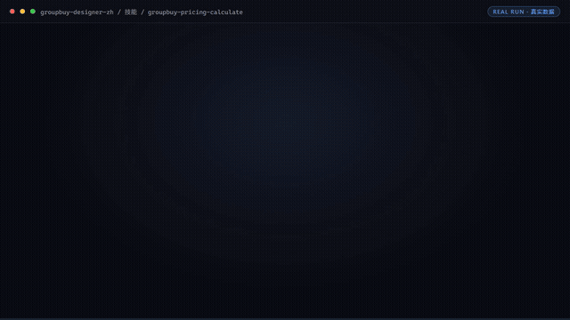

# 团购设计师

> **把"被平台牵着走的低价团购"变成"算得清毛利的引流武器"**



*▲ 实时演示（自动循环）· [▶ 观看完整版合集视频](docs/demo.mp4)*


[](https://github.com/bangwozuo)
[](#资产形态)
[](#资产形态)
[](LICENSE)

---

## 它是谁

面向 **本地生活商家** 的数字员工资产包。

| 项目 | 内容 |
|------|------|
| 目标用户 | 所有做团购的到店门店 |
| 交付物 | 套餐扣点后毛利 ≥ 老板设定红线；团购核销率提升；引流款→利润款转化率可追踪 |
| 技能数 | 4 |
| 工作流数 | 5 |
| 旧名存档 | `团购引流设计师` |

---

## 资产形态

**纯提示词资产** —— 这是理解本仓库的关键：

| 特性 | 说明 |
|------|------|
| ✅ 无需 API Key | 一个 Key 都不需要 |
| ✅ 无需部署 | 没有服务端，没有脚本 |
| ✅ 无需依赖 | 克隆后用文本编辑器就能看 |
| ✅ 平台无关 | 粘贴到任何 AI 工具即可使用 |
| ✅ 用户自备算力 | 模型来自你自己的订阅 |

---

## 快速开始

```text
1. 打开 skills/competitor-groupbuy-collect/prompt.txt
2. 全文复制
3. 粘贴到你常用的 AI 工具（Coze / WorkBuddy / Dify / Claude / ChatGPT）
4. 按 SKILL.md 的输入规格提供数据
```

就这四步。完整指引见 [使用手册](docs/04-usage.md)。

---

## 仓库结构

```text
groupbuy-designer-zh/
├── README.md / employee.md / package.yaml     # 入口与 12 字段定义卡
├── docs/01~07                                 # 员工级文档（架构/流程/场景/手册/示例/录像/测试）
├── skills/                                    # 4 个原子技能
│   └── <skill>/
│       ├── README.md  SKILL.md  prompt.txt  schema.json  examples/
│       └── docs/                              # 该技能自己的 10 项文档 + 配图
├── workflows/                                 # 5 条工作流（复合技能）
│   └── <workflow>/
│       ├── README.md  SKILL.md  prompt.txt  schema.json  examples/
│       └── docs/                              # 该工作流自己的 10 项文档 + 配图
├── knowledge/                                 # RAG wiki 知识库
│   ├── README.md  RAG-接入指南.md  template.md
│   └── wiki/(index.md, _template.md, entries/)
├── connectors/                                # 连接器说明 + 合规红线
├── quality/                                   # 效果基线与追踪日志
└── tests/                                     # 资产校验测试（离线，无需密钥）
```

### 每个技能 / 工作流自带的 docs

| 文档 | 内容 |
|------|------|
| `README.md` | 资产速览与快速开始 |
| `docs/01-usage-manual.md` | 安装使用手册 |
| `docs/02-architecture.md` | 业务架构图 |
| `docs/03-flow.md` | 流程图（Mermaid + 配图） |
| `docs/04-examples.md` | 使用示例 |
| `docs/05-media.md` | 截图和录屏（清单 + 分镜脚本） |
| `docs/06-scenarios.md` | 使用场景（适用 / 不适用） |
| `docs/07-audience.md` | 用户群体 |
| `docs/08-value.md` | 解决问题与价值 |
| `docs/09-test-report.md` | 测试报告 |
| `docs/assets/overview.svg` | 自动生成的流程示意图 |

---

## 交付物导航

| 文档 | 内容 |
|------|------|
| [业务架构](docs/01-architecture.md) | 四层架构 + 数据流 + 能力边界 |
| [工作流流程](docs/02-workflow.md) | 5 条工作流的 DAG 可视化 |
| [使用场景](docs/03-scenarios.md) | 3 个真实场景（含前后对比） |
| [使用手册](docs/04-usage.md) | 各平台导入指引 + 常见问题 |
| [示例库](docs/05-examples.md) | 4 组输入输出示例 |
| [录像脚本](docs/06-recording-script.md) | 7 镜头分镜 + 旁白稿 |
| [校验报告](docs/07-test-report.md) | 资产质量校验结果 |

---

## 技能清单（4 个）

| # | 技能 | 能力族 | 复杂度 | 提示词 | 文档 |
|---|------|--------|--------|--------|------|
| 1 | 竞品团购采集 | 数据采集 | `M` | [prompt.txt](skills/competitor-groupbuy-collect/prompt.txt) | [docs](skills/competitor-groupbuy-collect/docs/) |
| 2 | 团购定价测算 | 测算评估 | `S` | [prompt.txt](skills/groupbuy-pricing-calculate/prompt.txt) | [docs](skills/groupbuy-pricing-calculate/docs/) |
| 3 | 团购文案生成 | 文案生成 | `S` | [prompt.txt](skills/groupbuy-copy-generate/prompt.txt) | [docs](skills/groupbuy-copy-generate/docs/) |
| 4 | 平台规则库 | 知识检索 | `S` | [prompt.txt](skills/platform-rules-library/prompt.txt) | [docs](skills/platform-rules-library/docs/) |

## 工作流清单（5 条）

| # | 工作流 | 阶段 | 复杂度 | 触发 | 定义 | 文档 |
|---|--------|------|--------|------|------|------|
| 1 | 竞品团购追踪 | `P1` | `M` | 定时（每周） | [SKILL.md](workflows/competitor-groupbuy-track-flow/SKILL.md) | [docs](workflows/competitor-groupbuy-track-flow/docs/) |
| 2 | 套餐结构设计 | `P1` | `S` | 人工（发起策划） | [SKILL.md](workflows/package-structure-design-flow/SKILL.md) | [docs](workflows/package-structure-design-flow/docs/) |
| 3 | 扣点毛利测算 | `P1` | `S` | 随 W2 联动 | [SKILL.md](workflows/commission-margin-calc-flow/SKILL.md) | [docs](workflows/commission-margin-calc-flow/docs/) |
| 4 | 团购标题与图片文案 | `P1` | `S` | 随 W2 联动 | [SKILL.md](workflows/groupbuy-title-image-copy-flow/SKILL.md) | [docs](workflows/groupbuy-title-image-copy-flow/docs/) |
| 5 | 核销数据复盘调价 | `P2` | `M` | 定时（每月） | [SKILL.md](workflows/verification-recap-reprice-flow/SKILL.md) | [docs](workflows/verification-recap-reprice-flow/docs/) |

---

## 知识库与连接器

| 目录 | 说明 |
|------|------|
| [`knowledge/`](knowledge/README.md) | RAG wiki 知识库：填入业务信息可显著提升输出质量 |
| [`connectors/`](connectors/README.md) | 连接器说明：数据从哪来、怎么合规地来 |

---

## 资产校验

```bash
pip install -r requirements.txt
pytest tests/ -v
```

校验技能完整性、提示词结构、契约一致性、工作流 DAG、技能级与工作流级 docs 完整性、知识库 wiki 与连接器结构。
**不需要任何 API Key。**

---

## 合规声明

- ✅ 所有输出为 **AI 辅助生成**，交付前须人工审核
- ✅ 提示词内置**违禁词禁止清单**，符合《广告法》要求
- ✅ 遵循《人工智能生成合成内容标识办法》
- ✅ 连接器只走**官方 API** 或**用户导出数据**
- ✅ 所有对外发布动作**保留人工确认环节**

---

## 许可

[Apache-2.0](LICENSE) — 可自由使用、修改、商用

---

*由 bangwozuo 业务库自动生成 · 2026-09-29*
