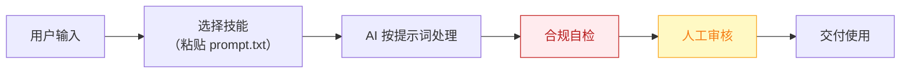

# 团购设计师 — 业务架构

## 四层视图

```mermaid
flowchart TD
    subgraph L1["① 用户层"]
        U["所有做团购的到店门店"]
    end

    subgraph L2["② 数字员工层"]
        E["团购设计师<br/>把"被平台牵着走的低价团购"变成"算得清毛利的引流武器""]
    end

    subgraph L3["③ 工作流层（5 条）"]
        W1["竞品团购追踪"]
        WN["…共 5 条"]
    end

    subgraph L4["④ 原子技能层（4 个）"]
        SK1["竞品团购采集"]
        SK2["团购定价测算"]
        SK3["团购文案生成"]
        SK4["平台规则库"]
    end

    U -->|"提出需求"| E
    E -->|"编排调用"| W1
    W1 --> WN
    W1 --> SK1

    style L1 fill:#E8F4FD,stroke:#1976D2,color:#0D47A1
    style L2 fill:#FFF3E0,stroke:#E65100,color:#BF360C
    style L3 fill:#F3E5F5,stroke:#7B1FA2,color:#4A148C
    style L4 fill:#E8F5E9,stroke:#388E3C,color:#1B5E20
```

## 资产形态说明

本资产包为**纯提示词客户端资产**：

| 特性 | 说明 |
|------|------|
| 无运行时依赖 | 不调用任何模型 API，不需要 API Key |
| 平台无关 | 提示词为纯文本，可导入任意主流 AI 平台 |
| 用户自备算力 | 模型由用户自己的订阅提供 |
| 零服务端成本 | 资产方不产生任何调用费用 |

## 数据流



> **关键设计**：所有对外输出必须经过「合规自检 → 人工审核」双闸门。

## 能力边界

| 维度 | 内容 |
|------|------|
| **目标用户** | 所有做团购的到店门店 |
| **做** | **做**：竞品团购监控、三级套餐结构设计、扣点后毛利测算、上架文案；** |
| **不做** | 不做**：不替商家拍板定价（只出测算与方案）、 |
| **KPI** | 套餐扣点后毛利 ≥ 老板设定红线；团购核销率提升；引流款→利润款转化率可追踪 |
| **定价** | 100–300 元/月，或按套餐策划 200–500 元/次；**代配置服务加成：300–800 元/次**（成本表梳理+首套三级套餐陪跑上架） |

---

*本图由 build_p0_assets.py 自动生成*
