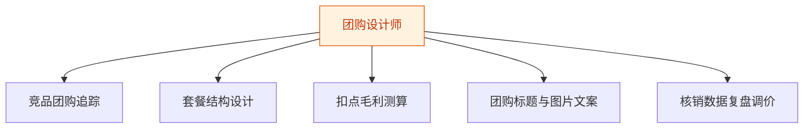
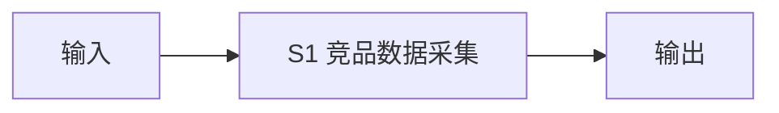
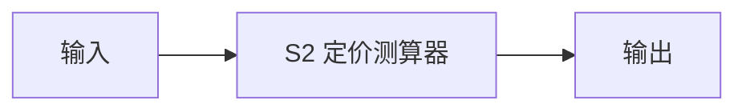
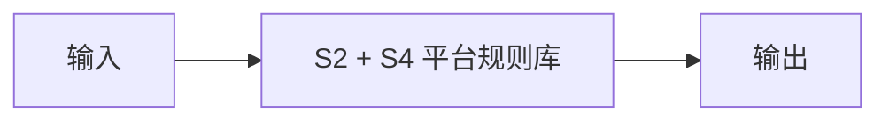
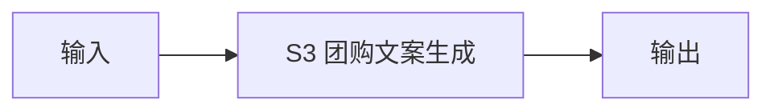
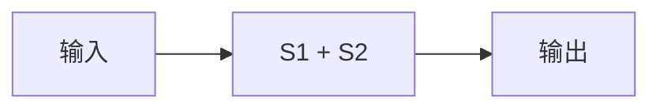

# 团购设计师 — 工作流流程图

本员工共 **5 条工作流**，下辖 **4 个原子技能**。

## 总览

## 分条详情

### 竞品团购追踪

| 项目 | 内容 |
|------|------|
| 触发 | 定时（每周） |
| 复杂度 | `M` |
| 阶段 | `P1` |
| ROI | 替代人工逛街调研，月省 8 小时 |

### 套餐结构设计

| 项目 | 内容 |
|------|------|
| 触发 | 人工（发起策划） |
| 复杂度 | `S` |
| 阶段 | `P1` |
| ROI | 一次策划服务市价 200–500 元（据 R4 调研） |

### 扣点毛利测算

| 项目 | 内容 |
|------|------|
| 触发 | 随 W2 联动 |
| 复杂度 | `S` |
| 阶段 | `P1` |
| ROI | 避免单笔亏损套餐，止损价值直接 |

### 团购标题与图片文案

| 项目 | 内容 |
|------|------|
| 触发 | 随 W2 联动 |
| 复杂度 | `S` |
| 阶段 | `P1` |
| ROI | 打包计入 W2 |

### 核销数据复盘调价

| 项目 | 内容 |
|------|------|
| 触发 | 定时（每月） |
| 复杂度 | `M` |
| 阶段 | `P2` |
| ROI | 让套餐持续迭代而非一锤子买卖 |

## 汇总表

| # | 工作流 | 阶段 | 复杂度 | 触发 | 涉及技能数 |
|---|--------|------|--------|------|-----------|
| 1 | 竞品团购追踪 | `P1` | `M` | 定时（每周） | 1 |
| 2 | 套餐结构设计 | `P1` | `S` | 人工（发起策划） | 1 |
| 3 | 扣点毛利测算 | `P1` | `S` | 随 W2 联动 | 1 |
| 4 | 团购标题与图片文案 | `P1` | `S` | 随 W2 联动 | 1 |
| 5 | 核销数据复盘调价 | `P2` | `M` | 定时（每月） | 1 |

---

*本图由 build_p0_assets.py 自动生成*
