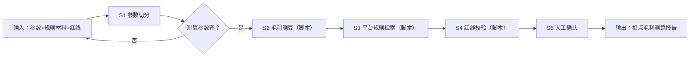

# 扣点毛利测算

## 元信息

| 字段 | 值 |
|------|-----|
| ID | `de_local_04_wf03` |
| 类型 | **`composite`（复合技能）** |
| 所属员工 | 团购设计师 |
| 阶段 | `P1` |
| 复杂度 | `M` |
| 触发方式 | 人工（定价评审时，随 W2 联动） |
| ROI | 定价评审一次约 1 小时 → 3 分钟；避免单笔亏损套餐，止损价值直接 |
| 资产形态 | 提示词编排 + Python 脚本（无模型调用、无 API Key） |

> 复合技能 = 工作流。它把多个**原子技能**按业务顺序编排在一起，完成一个完整场景。

## 能力描述

1. **S1 参数切分**（确定性）：按「一、二、三、」切为 测算参数 / 平台规则材料 / 毛利红线 三段；测算参数缺技术服务费率时从规则材料抽取并注明「取自规则材料」
2. **S2 毛利测算**（脚本承担）：扣点 = 到手价 × 费率；佣金 = 到手价 × 佣金率；毛利 = 到手价 − 扣点 − 佣金 − 食材 − 包装；经营毛利 = 毛利 − 分摊；金额四舍五入到 0.1 元
3. **S3 平台规则检索**（脚本承担）：召回费率条目并逐条引用，核对费率口径；费率冲突时以规则材料为准并标注
4. **S4 毛利红线校验**（脚本承担）：默认红线为经营毛利率 ≥25%（输入明示优先）；未达标即拦截并给调价方向
5. **S5 人工确认**：费率与成本人工复核后才可对外使用

## 编排的原子技能

| # | 原子技能 | 能力 |
|---|---------|------|
| 1 | [团购定价测算](../../skills/groupbuy-pricing-calculate/) | 扣点+成本+毛利联动测算 |
| 2 | [平台规则库](../../skills/platform-rules-library/) | 美团/抖音扣点与上架规则查询 |

## 步骤链路（DAG）



## 步骤明细

| # | 步骤 | 技能资产 | 输入 | 输出 | 失败处理 |
|---|------|---------|------|------|---------|
| 1 | 参数切分 | 本流脚本（run_flow.py） | input 原始文本 | 三段切分（step1_参数切分.json） | 测算参数段缺失 → 退回补录 |
| 2 | 毛利测算 | [`../../skills/groupbuy-pricing-calculate/`](../../skills/groupbuy-pricing-calculate/)（脚本承担） | S1 测算参数 | 逐项毛利明细（step2_毛利测算/） | 缺参数 → 列清单中止 |
| 3 | 平台规则检索 | [`../../skills/platform-rules-library/`](../../skills/platform-rules-library/)（脚本承担） | S1 规则材料 | 费率条目引用（step3_规则检索/） | 无材料 → 跳过并提示人工核实费率 |
| 4 | 红线校验 | 本流脚本（run_flow.py） | S2 经营毛利率 + 红线 | 达标/拦截判定 | 红线缺失 → 用默认 25% 并注明 |
| 5 | 人工确认 | （人工） | 测算报告 | 确认后的定价结论 | 费率有变退回 S2 重算 |

## 输入规格

| 字段 | 类型 | 必填 | 说明 |
|------|------|------|------|
| `input` | string / object | ✅ | 工作流初始输入：一、测算参数；二、平台规则材料（【条目A】…格式）；三、毛利红线（如"经营毛利率不低于25%"） |

## 输出规格

| 字段 | 类型 | 说明 |
|------|------|------|
| `summary` | string | 执行摘要（经营毛利率 vs 红线，达标/拦截） |
| `steps` | string | 分步结果（S1 切分 / S2 测算 / S3 检索 / S4 校验 / S5 人工确认） |
| `deliverable` | string | 最终交付物：毛利明细表 + 费率口径引用 + 红线判定 |
| 产物 | file | `out/step1_参数切分.json`、`out/step2_毛利测算/`、`out/step3_规则检索/`、`out/flow_result.json`、`out/扣点毛利测算报告.md` |

## 错误处理

| 情况 | 处理方式 |
|------|---------|
| 输入缺失 | 提示缺少的字段，终止流程 |
| 测算参数段缺失 | 退回补录，不估算 |
| 规则材料缺失 | 跳过检索步，报告注明「费率需人工核实」 |
| 中间步骤输出不合规 | 合规技能拦截，返回修改建议，不继续下游 |

## 验收标准

- [ ] 每一步的技能资产齐全（SKILL.md / prompt.txt / schema.json / scripts）
- [ ] 步骤间输入输出字段可衔接
- [ ] 费率有出处（参数或条目引用），红线判定有明确达标/拦截结论
- [ ] 末步输出带 AI 生成标识
- [ ] 全流程有人工确认环节

## 使用步骤

### 方式一：纯提示词编排（跨平台）

1. 把 `prompt.txt` 全文粘贴为系统提示词
2. 提供测算参数、平台规则材料与红线
3. 按 S1→S5 得到红线判定

### 方式二：带脚本（端到端产物，推荐）

```bash
python <WF_DIR>/scripts/run_flow.py --input examples/input.json --outdir out
python <WF_DIR>/scripts/run_flow.py --demo
```

| 平台 | 编排方式 |
|------|---------|
| **Coze / 扣子** | 工作流节点填两个原子技能 prompt.txt，测算/检索/校验用代码节点跑 run_flow.py |
| **Dify** | Workflow → LLM 节点链 + 代码节点 |
| **WorkBuddy** | 新建 Skill 按 prompt.txt 步骤串联 |

## 边界（不做的事）

- ❌ 不缺费率硬算——费率必须有出处，冲突时标注而非静默取值
- ❌ 不替用户做上架决策——拦截判定只是风险提示
- ❌ 不虚构平台费率——以商家后台当期公示为准
- ❌ 不跳过人工确认直接交付

## 调用示例

**输入**（`examples/input.json`）：双人套餐到手价 89 元、食材 32 元、佣金 6%；规则材料【条目A】抖音技术服务费 2.5% 等 4 条；红线「经营毛利率不低于25%」。

**输出**（脚本实跑）：扣点 2.2 元 + 佣金 5.3 元，经营毛利率 30.3% vs 红线 25% → 🟢 达标；费率口径引用 3 条。报告落 `out/扣点毛利测算报告.md`。

## 所属工作流

本资产为复合技能（工作流），是独立的端到端流程；上游可接
[套餐结构设计](../package-structure-design-flow/)（对选定档位做费率复核），
下游可接[核销数据复盘调价](../verification-recap-reprice-flow/)（调价后重跑红线校验）。

## 合规声明

- 输出标注「AI 生成内容」；涉及资金测算仅为草稿，交付前必须经人工复核
- 平台费率以商家后台当期公示为准
- 涉及资金的输出不执行写操作，不替代用户做最终决策
