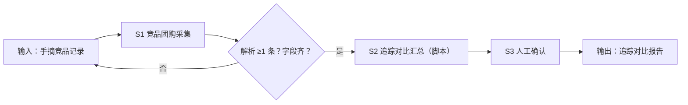

# 竞品团购追踪

## 元信息

| 字段 | 值 |
|------|-----|
| ID | `de_local_04_wf01` |
| 类型 | **`composite`（复合技能）** |
| 所属员工 | 团购设计师 |
| 阶段 | `P1` |
| 复杂度 | `M` |
| 触发方式 | 定时（每周） |
| ROI | 替代人工逛街调研，月省 8 小时 |
| 资产形态 | 提示词编排 + Python 脚本（无模型调用、无 API Key） |

> 复合技能 = 工作流。它把多个**原子技能**按业务顺序编排在一起，完成一个完整场景。

## 能力描述

1. **S1 竞品团购采集**（确定性解析）：把用户手摘记录（一条一个带圈序号）解析为 店名/套餐类型/原价/现价/内容限制；折扣率 = 现价 ÷ 原价 × 100%，保留 1 位小数；条数上限 10 条，超出按现价从低到高截断
2. **S2 追踪对比汇总**（脚本承担）：价格带三分档（<100 元引流带 / 100-200 元主力带 / >200 元利润带）逐带计数；折扣率 <50% 标「深折扣，需重点盯」；产出对比表与追踪要点
3. **S3 人工确认**：对比表交付前由用户复核来源与数字，确认后进入周度追踪存档

## 编排的原子技能

| # | 原子技能 | 能力 |
|---|---------|------|
| 1 | [竞品团购采集](../../skills/competitor-groupbuy-collect/) | 商圈竞品团购信息抓取（BusinessConnector） |

## 步骤链路（DAG）



## 步骤明细

| # | 步骤 | 技能资产 | 输入 | 输出 | 失败处理 |
|---|------|---------|------|------|---------|
| 1 | 竞品团购采集 | [`../../skills/competitor-groupbuy-collect/`](../../skills/competitor-groupbuy-collect/) | 手摘原始记录 | 结构化条目清单（step1_采集明细.json） | 解析 0 条或字段缺失 → 列缺口清单退回补录 |
| 2 | 追踪对比汇总 | 本流脚本（run_flow.py） | S1 条目清单 | 价格带分布 + 对比表（追踪对比报告.md） | 全部条目无现价 → 中止并说明 |
| 3 | 人工确认 | （人工） | 对比表 | 确认后的周度追踪存档 | 有疑问条目退回 S1 复核 |

## 输入规格

| 字段 | 类型 | 必填 | 说明 |
|------|------|------|------|
| `input` | string / object | ✅ | 工作流初始输入：任务描述 + 手摘原始记录（含店名、套餐、原价、现价、时间窗口、筛选条件） |

## 输出规格

| 字段 | 类型 | 说明 |
|------|------|------|
| `summary` | string | 执行摘要（条数、现价区间、深折扣条数） |
| `steps` | string | 分步结果（S1 解析 / S2 汇总 / S3 人工确认） |
| `deliverable` | string | 最终交付物：追踪对比表 + 商圈竞争概览 |
| 产物 | file | `out/step1_采集明细.json`、`out/flow_result.json`、`out/追踪对比报告.md` |

## 错误处理

| 情况 | 处理方式 |
|------|---------|
| 输入缺失 | 提示缺少的字段，终止流程 |
| 解析 0 条 / 字段缺失 | 合规技能拦截，返回缺口清单，不继续下游 |
| 全部条目无现价 | 中止，索要有价格的摘录 |
| 提示词被平台截断 | 拆分任务，分两次处理 |

## 验收标准

- [ ] 每一步的技能资产齐全（SKILL.md / prompt.txt / schema.json / scripts）
- [ ] 步骤间输入输出字段可衔接
- [ ] 对比表逐条有现价与折扣率（无原价的折扣率标「-」）
- [ ] 末步输出带 AI 生成标识
- [ ] 全流程有人工确认环节

## 使用步骤

### 方式一：纯提示词编排（跨平台）

1. 把 `prompt.txt` 全文粘贴为系统提示词
2. 提供商圈、品类与手摘竞品记录
3. 按 S1→S2→S3 得到追踪对比表

### 方式二：带脚本（端到端产物，推荐）

```bash
python <WF_DIR>/scripts/run_flow.py --input examples/input.json --outdir out
python <WF_DIR>/scripts/run_flow.py --demo
```

| 平台 | 编排方式 |
|------|---------|
| **Coze / 扣子** | 工作流节点填采集技能 prompt.txt，汇总步用代码节点跑 run_flow.py |
| **Dify** | Workflow → LLM 节点 + 代码节点 |
| **WorkBuddy** | 新建 Skill 按 prompt.txt 步骤串联 |

## 边界（不做的事）

- ❌ 不爬取需登录的私域数据，不绕过平台风控
- ❌ 不虚构/补全缺失的竞品价格字段——列缺口清单
- ❌ 不给「必胜」定价结论——只做对比与追踪要点，定价决策归「套餐结构设计」
- ❌ 不替代人工确认直接存档为周度结论

## 调用示例

**输入**（`examples/input.json`）：武汉江汉路商圈火锅品类 6 条手摘记录（2026-09-25 至 2026-10-07，限在售、3 公里内）。

**输出**（脚本实跑）：采集 6 条，现价区间 98-328 元（均值约 200 元），引流带 1 条 / 主力带 2 条 / 利润带 3 条，蜀大侠双人套餐折扣率 36.6% 被标为深折扣重点盯防对象。对比表落 `out/追踪对比报告.md`。

## 所属工作流

本资产为复合技能（工作流），是独立的端到端流程；上游可接商圈调研规划，下游可接
[核销数据复盘调价](../verification-recap-reprice-flow/)（把竞品价格带入调价决策）。

## 合规声明

- 输出标注「AI 生成内容」；交付前经人工复核
- 采集仅限公开商家展示信息，不存储用户个人隐私数据
- 竞品价格随平台活动波动，追踪结论仅代表采集时点快照
