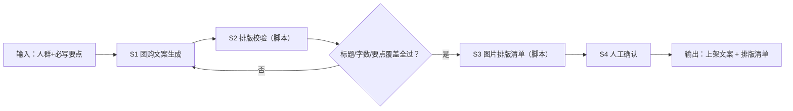

# 团购标题与图片文案

## 元信息

| 字段 | 值 |
|------|-----|
| ID | `de_local_04_wf04` |
| 类型 | **`composite`（复合技能）** |
| 所属员工 | 团购设计师 |
| 阶段 | `P1` |
| 复杂度 | `S` |
| 触发方式 | 人工（上架准备时） |
| ROI | 单套上架素材制作约 2 小时 → 15 分钟 |
| 资产形态 | 提示词编排 + Python 脚本（无模型调用、无 API Key） |

> 复合技能 = 工作流。它把多个**原子技能**按业务顺序编排在一起，完成一个完整场景。

## 能力描述

1. **S1 文案生成**（模型步）：按「团购文案生成」产出 3 个备选标题（每个 ≤20 字，价格锚点/场景人群/资质信任三种结构，标推荐项）+ 五段式正文（场景钩子 → 信任背书 → 套餐清单 → 使用规则 → 行动号召，150-300 字）
2. **S2 排版确定性校验**（脚本承担）：标题字数 ≤20 字逐个核对；正文去标点实数 150-300 字；必写要点关键数字（88 元 / 40 支 / 90 天 / 17:00 等）逐个核对在正文出现，缺一项判 🔴 退回
3. **S3 图片排版清单**（脚本承担）：主图 1 张（首图信息点 ≤5 个）+ 细节图 ≥3 张 + 规则图 1 张，图内数字与正文一致
4. **S4 人工确认**：文案与图片清单交付前逐项人工复核

## 编排的原子技能

| # | 原子技能 | 能力 |
|---|---------|------|
| 1 | [团购文案生成](../../skills/groupbuy-copy-generate/) | 套餐卖点文案 |

## 步骤链路（DAG）



## 步骤明细

| # | 步骤 | 技能资产 | 输入 | 输出 | 失败处理 |
|---|------|---------|------|------|---------|
| 1 | 文案生成 | [`../../skills/groupbuy-copy-generate/`](../../skills/groupbuy-copy-generate/) | 人群 + 必写要点 | 3 标题 + 五段式正文 | 要点缺失 → 退回补录 |
| 2 | 排版校验 | 本流脚本（run_flow.py） | S1 文案草稿 | 逐项判定表 | 🔴 项 >0 → 退回 S1 重写 |
| 3 | 图片排版清单 | 本流脚本（run_flow.py） | S2 通过的文案 | 5 类图位清单 | 正文改动后必须重出清单 |
| 4 | 人工确认 | （人工） | 校验报告 | 可发布素材包 | 数字有变退回 S1 |

## 输入规格

| 字段 | 类型 | 必填 | 说明 |
|------|------|------|------|
| `input` | string / object | ✅ | 工作流初始输入：任务描述、目标人群、必写要点（价格/内容/时段/资质/有效期） |
| `draft` | object | ⬜ | S1 模型产出（titles + body）；带脚本运行时由此字段传入校验步 |

## 输出规格

| 字段 | 类型 | 说明 |
|------|------|------|
| `summary` | string | 执行摘要（校验 N 项、不通过 M 项、整体判定） |
| `steps` | string | 分步结果（S1 生成 / S2 校验 / S3 清单 / S4 人工确认） |
| `deliverable` | string | 最终交付物：校验表 + 图片排版清单 |
| 产物 | file | `out/step1_文案草稿.json`、`out/flow_result.json`、`out/文案排版校验报告.md` |

## 错误处理

| 情况 | 处理方式 |
|------|---------|
| 输入缺失 | 提示缺少的字段，终止流程 |
| 缺 draft（未跑 S1） | 提示先按原子技能 prompt 产出文案再传入 |
| 标题超标 / 正文偏少 | 🔴 给出补/删字数，退回 S1 |
| 要点数字缺失 | 🔴 标明缺失数字，退回 S1 |
| 提示词被平台截断 | 拆分任务，分两次处理 |

## 验收标准

- [ ] 每一步的技能资产齐全（SKILL.md / prompt.txt / schema.json / scripts）
- [ ] 步骤间输入输出字段可衔接
- [ ] 标题 ≤20 字、正文 150-300 字、要点数字全覆盖
- [ ] 末步输出带 AI 生成标识
- [ ] 全流程有人工确认环节

## 使用步骤

### 方式一：纯提示词编排（跨平台）

1. 把 `prompt.txt` 全文粘贴为系统提示词
2. 提供人群与必写要点
3. 按 S1→S4 得到上架文案与图片清单

### 方式二：带脚本（端到端产物，推荐）

```bash
python <WF_DIR>/scripts/run_flow.py --input input.json --outdir out   # input 含 draft
python <WF_DIR>/scripts/run_flow.py --demo
```

| 平台 | 编排方式 |
|------|---------|
| **Coze / 扣子** | 工作流节点填文案技能 prompt.txt，校验步用代码节点跑 run_flow.py |
| **Dify** | Workflow → LLM 节点 + 代码节点 |
| **WorkBuddy** | 新建 Skill 按 prompt.txt 步骤串联 |

## 边界（不做的事）

- ❌ 不跳过校验交付——「感觉可以」不算校验
- ❌ 不用模型口算字数——以脚本去标点实数为准
- ❌ 不生成虚假门店场景图——图片只用用户提供的真实素材
- ❌ 不编造资质与销量数字
- ❌ 不跳过人工确认

## 调用示例

**输入**（`examples/input.json`）：锦城巷串串香春熙路店，人群 25-35 岁上班族与学生，必写要点 88 元双人餐 / 80 支签签 / 17:00 免预约 / 90 天有效期。

**输出**（脚本实跑）：3 个标题 20/19/15 字全部达标，正文去标点 178 字落在 150-300 区间，6 个要点数字全覆盖，12 项校验 0 项不通过 → ✅ 通过；图片排版清单 5 类图位。报告落 `out/文案排版校验报告.md`。

## 所属工作流

本资产为复合技能（工作流），是独立的端到端流程；上游可接
[套餐结构设计](../package-structure-design-flow/)（三档定价确定后出素材），
下游可接[核销数据复盘调价](../verification-recap-reprice-flow/)（调价后同步改素材价格）。

## 合规声明

- 输出标注「AI 生成内容」；发布前整稿人工确认
- 文案不承诺兑现不了的效果；价格、有效期、退款规则须与平台最终配置一致
- 图片素材只使用用户提供的真实门店照片与资质
