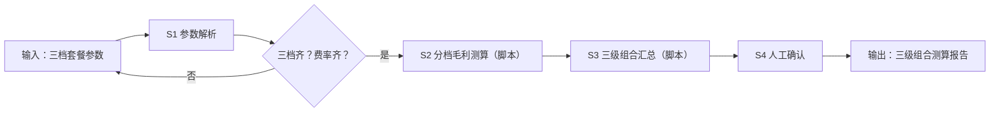

# 套餐结构设计

## 元信息

| 字段 | 值 |
|------|-----|
| ID | `de_local_04_wf02` |
| 类型 | **`composite`（复合技能）** |
| 所属员工 | 团购设计师 |
| 阶段 | `P1` |
| 复杂度 | `S` |
| 触发方式 | 人工（发起策划） |
| ROI | 一次策划服务市价 200–500 元（据 R4 调研） |
| 资产形态 | 提示词编排 + Python 脚本（无模型调用、无 API Key） |

> 复合技能 = 工作流。它把多个**原子技能**按业务顺序编排在一起，完成一个完整场景。

## 能力描述

1. **S1 套餐参数解析**（确定性）：从输入抽取引流款/主力款/利润款三档的 套餐名/到手价/食材成本/包装成本 与全局费率（技术服务费、佣金、固定分摊、人力分摊）；缺项列缺口清单，不估算
2. **S2 分档毛利测算**（脚本承担）：逐档执行「团购定价测算」公式（扣点 = 到手价 × 费率；毛利 = 到手价 − 扣点 − 佣金 − 食材 − 包装；经营毛利 = 毛利 − 分摊），金额四舍五入到 0.1 元
3. **S3 三级组合汇总**（脚本承担）：三档对比表 + 毛利红线判定（经营毛利率 <25% 🟡 需复核、<15% 🔴 重新设计）+ 组合结构提示（引流款与主力款到手价建议拉开 ≥2 倍）
4. **S4 人工确认**：成本与费率人工复核后才可对外使用

## 编排的原子技能

| # | 原子技能 | 能力 |
|---|---------|------|
| 1 | [团购定价测算](../../skills/groupbuy-pricing-calculate/) | 扣点+成本+毛利联动测算 |

## 步骤链路（DAG）



## 步骤明细

| # | 步骤 | 技能资产 | 输入 | 输出 | 失败处理 |
|---|------|---------|------|------|---------|
| 1 | 套餐参数解析 | 本流脚本（run_flow.py） | input 原始文本 | 三档参数 + 全局费率（step1_三档参数.json） | 档位/费率缺失 → 列缺口清单退回 |
| 2 | 分档毛利测算 | [`../../skills/groupbuy-pricing-calculate/`](../../skills/groupbuy-pricing-calculate/)（脚本承担） | S1 三档参数 | 逐档毛利/毛利率/经营毛利 | 测算失败 → 中止并说明缺失参数 |
| 3 | 三级组合汇总 | 本流脚本（run_flow.py） | S2 测算结果 | 组合对比表 + 红线判定 | 无达标档位 → 全表标红并提示 |
| 4 | 人工确认 | （人工） | 组合对比表 | 确认后的套餐结构 | 成本有变退回 S2 重算 |

## 输入规格

| 字段 | 类型 | 必填 | 说明 |
|------|------|------|------|
| `input` | string / object | ✅ | 工作流初始输入：三档套餐参数（到手价/食材成本/包装成本）+ 全局费率（技术服务费 %、佣金 %、固定分摊 元/单、人力分摊 元/单） |

## 输出规格

| 字段 | 类型 | 说明 |
|------|------|------|
| `summary` | string | 执行摘要（三档毛利率与红线判定） |
| `steps` | string | 分步结果（S1 解析 / S2 测算 / S3 汇总 / S4 人工确认） |
| `deliverable` | string | 最终交付物：三级组合对比表 + 组合结构提示 |
| 产物 | file | `out/step1_三档参数.json`、`out/flow_result.json`、`out/三级组合测算报告.md` |

## 错误处理

| 情况 | 处理方式 |
|------|---------|
| 输入缺失 | 提示缺少的字段，终止流程 |
| 档位或费率缺失 | 列缺口清单退回，不估算 |
| 中间步骤输出不合规 | 合规技能拦截，返回修改建议，不继续下游 |
| 提示词被平台截断 | 拆分任务，分两次处理 |

## 验收标准

- [ ] 每一步的技能资产齐全（SKILL.md / prompt.txt / schema.json / scripts）
- [ ] 步骤间输入输出字段可衔接
- [ ] 三档逐档有毛利、毛利率、经营毛利与红线判定
- [ ] 末步输出带 AI 生成标识
- [ ] 全流程有人工确认环节

## 使用步骤

### 方式一：纯提示词编排（跨平台）

1. 把 `prompt.txt` 全文粘贴为系统提示词
2. 提供三档套餐参数与全局费率
3. 按 S1→S2→S3→S4 得到三级组合建议

### 方式二：带脚本（端到端产物，推荐）

```bash
python <WF_DIR>/scripts/run_flow.py --input examples/input.json --outdir out
python <WF_DIR>/scripts/run_flow.py --demo
```

| 平台 | 编排方式 |
|------|---------|
| **Coze / 扣子** | 工作流节点填定价测算技能 prompt.txt，测算步用代码节点跑 run_flow.py |
| **Dify** | Workflow → LLM 节点 + 代码节点 |
| **WorkBuddy** | 新建 Skill 按 prompt.txt 步骤串联 |

## 边界（不做的事）

- ❌ 不缺参数硬算——缺到手价/食材成本/费率一律退回补录
- ❌ 不替用户拍板最终定价——只给红线判定与结构提示
- ❌ 不虚构平台费率——以用户提供与商家后台公示为准
- ❌ 不跳过人工确认直接交付

## 调用示例

**输入**（`examples/input.json`）：锦城巷串串香三档参数——引流款 39.9 元 / 主力款 88 元 / 利润款 168 元，技术服务费 2%、佣金 6%，固定分摊 8 元/单、人力分摊 12 元/单。

**输出**（脚本实跑）：引流款毛利率 49.4% 但经营毛利率 -0.8%（🔴 建议重新设计）、主力款 30.0%（🟢）、利润款 37.2%（🟢）。三级组合对比表落 `out/三级组合测算报告.md`。

## 所属工作流

本资产为复合技能（工作流），是独立的端到端流程；上游可接
[竞品团购追踪](../competitor-groupbuy-track-flow/)（用竞品价格带校准三档定位），
下游可接[扣点毛利测算](../commission-margin-calc-flow/)（对选定档位做费率敏感性复核）。

## 合规声明

- 输出标注「AI 生成内容」；定价决策前必须经人工复核
- 平台费率以商家后台当期公示为准，脚本测算仅为草稿口径
- 涉及资金的输出不执行写操作，不替代用户做最终决策
