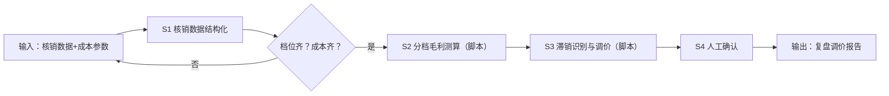

# 核销数据复盘调价

## 元信息

| 字段 | 值 |
|------|-----|
| ID | `de_local_04_wf05` |
| 类型 | **`composite`（复合技能）** |
| 所属员工 | 团购设计师 |
| 阶段 | `P1` |
| 复杂度 | `M` |
| 触发方式 | 定时（每月复盘） |
| ROI | 月度复盘约 3 小时 → 20 分钟，滞销款止损直接可见 |
| 资产形态 | 提示词编排 + Python 脚本（无模型调用、无 API Key） |

> 复合技能 = 工作流。它把多个**原子技能**按业务顺序编排在一起，完成一个完整场景。

## 能力描述

1. **S1 核销数据结构化**（确定性）：逐档解析 套餐名/到手价/售出/核销/核销率，并按「核销份数 ÷ 售出份数 × 100%」重算交叉核对，偏差 ≥0.1 个百分点标注
2. **S2 分档毛利测算**（脚本承担）：调「团购定价测算」逐档算毛利与经营毛利，金额四舍五入到 0.1 元
3. **S3 滞销识别与调价建议**（脚本承担）：核销率 <60% 判滞销、60-80% 正常、≥80% 表现良好；滞销款按降价 10% 试算——调价后经营毛利 >0 给降价建议，≤0 判「降价无效，建议换品」
4. **S4 人工确认**：调价决策前人工复核成本与核销口径

## 编排的原子技能

| # | 原子技能 | 能力 |
|---|---------|------|
| 1 | [竞品团购采集](../../skills/competitor-groupbuy-collect/) | 商圈竞品团购信息抓取（BusinessConnector） |
| 2 | [团购定价测算](../../skills/groupbuy-pricing-calculate/) | 扣点+成本+毛利联动测算 |

## 步骤链路（DAG）



## 步骤明细

| # | 步骤 | 技能资产 | 输入 | 输出 | 失败处理 |
|---|------|---------|------|------|---------|
| 1 | 核销数据结构化 | 本流脚本（run_flow.py） | input 原始文本 | 逐档结构化（step1_核销结构化.json） | 解析 0 档 / 成本缺失 → 列清单退回 |
| 2 | 分档毛利测算 | [`../../skills/groupbuy-pricing-calculate/`](../../skills/groupbuy-pricing-calculate/)（脚本承担） | S1 结构化数据 | 逐档毛利（step2_毛利测算/） | 测算失败 → 跳过该档并注明 |
| 3 | 滞销识别与调价 | 本流脚本（run_flow.py） | S2 毛利 + 核销率 | 判定 + 调价/换品建议（step3_调价测算/） | 降价后经营毛利 ≤0 → 改判换品 |
| 4 | 人工确认 | （人工） | 复盘调价报告 | 确认后的调价单 | 成本有变退回 S2 重算 |

## 输入规格

| 字段 | 类型 | 必填 | 说明 |
|------|------|------|------|
| `input` | string / object | ✅ | 工作流初始输入：一、核销数据（逐档售出/核销/核销率）；二、成本参数（食材/包装/费率/分摊）；三、调整目标（滞销线与测算要求） |

## 输出规格

| 字段 | 类型 | 说明 |
|------|------|------|
| `summary` | string | 执行摘要（复盘 N 档、滞销 M 档） |
| `steps` | string | 分步结果（S1 结构化 / S2 测算 / S3 调价 / S4 人工确认） |
| `deliverable` | string | 最终交付物：逐档判定表 + 调价/换品建议 |
| 产物 | file | `out/step1_核销结构化.json`、`out/step2_毛利测算/`、`out/step3_调价测算/`、`out/flow_result.json`、`out/复盘调价报告.md` |

## 错误处理

| 情况 | 处理方式 |
|------|---------|
| 输入缺失 | 提示缺少的字段，终止流程 |
| 成本参数缺失 | 列清单退回，不估算 |
| 核销率与重算不一致 | 标注不一致，按重算口径继续 |
| 中间步骤输出不合规 | 合规技能拦截，返回修改建议，不继续下游 |

## 验收标准

- [ ] 每一步的技能资产齐全（SKILL.md / prompt.txt / schema.json / scripts）
- [ ] 步骤间输入输出字段可衔接
- [ ] 逐档有核销率判定与调价/换品建议，滞销款有调价后毛利测算
- [ ] 末步输出带 AI 生成标识
- [ ] 全流程有人工确认环节

## 使用步骤

### 方式一：纯提示词编排（跨平台）

1. 把 `prompt.txt` 全文粘贴为系统提示词
2. 提供核销数据与成本参数
3. 按 S1→S4 得到复盘调价报告

### 方式二：带脚本（端到端产物，推荐）

```bash
python <WF_DIR>/scripts/run_flow.py --input examples/input.json --outdir out
python <WF_DIR>/scripts/run_flow.py --demo
```

| 平台 | 编排方式 |
|------|---------|
| **Coze / 扣子** | 工作流节点填定价测算技能 prompt.txt，测算/判定用代码节点跑 run_flow.py |
| **Dify** | Workflow → LLM 节点链 + 代码节点 |
| **WorkBuddy** | 新建 Skill 按 prompt.txt 步骤串联 |

## 边界（不做的事）

- ❌ 不缺成本参数硬算——缺食材/包装/费率一律退回
- ❌ 不替用户拍板调价——建议仅为草稿，需人工确认后改平台价格
- ❌ 不用单档核销率下长期结论——建议标注观察周期（如 1 个月）
- ❌ 不编造竞品对照数据——需对照时先跑[竞品团购追踪](../competitor-groupbuy-track-flow/)

## 调用示例

**输入**（`examples/input.json`）：4 档套餐 2026-09 核销数据（核销率 62%/84%/22%/87%）+ 逐档成本参数 + 目标「核销率低于60%视为滞销」。

**输出**（脚本实跑）：4 档复盘、滞销 1 档——四人聚会套餐核销率 22% 判滞销，降价 10% 至 151.2 元后经营毛利率 37.2%→31.2% 仍为正，给降价建议；单人尝鲜 62% 正常观察；双档 ≥80% 表现良好。报告落 `out/复盘调价报告.md`。

## 所属工作流

本资产为复合技能（工作流），是独立的端到端流程；上游可接
[竞品团购追踪](../competitor-groupbuy-track-flow/)（用竞品现价校准降幅）
与[扣点毛利测算](../commission-margin-calc-flow/)（调价后重跑红线校验）。

## 合规声明

- 输出标注「AI 生成内容」；调价决策前必须经人工复核
- 核销数据来自商家后台，含经营信息，不对外披露明细
- 调价涉及资金，输出仅为草稿建议，不执行写操作
